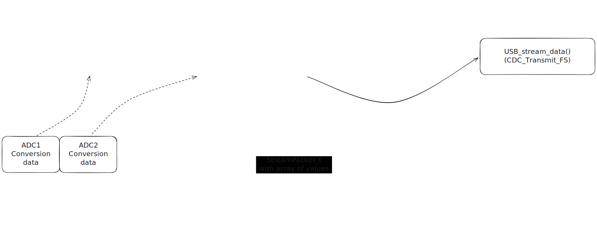
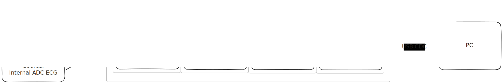

# Программа для считывания данных ЭКГ контроллером STM32G431CBU6

## Документация
[Документация на код](https://jerrycarson.github.io/ecg_stm/)

## Содержание

- [Программа для считывания данных ЭКГ контроллером STM32G431CBU6](#программа-для-считывания-данных-экг-контроллером-stm32g431cbu6)
  - [Документация](#документация)
  - [Содержание](#содержание)
  - [Как билдить и запускать программу](#как-билдить-и-запускать-программу)
  - [Функциональность программы](#функциональность-программы)
  - [Примерная схема стриминга данных](#примерная-схема-стриминга-данных)
  - [Сбор данных с периферии контроллера](#сбор-данных-с-периферии-контроллера)
  - [Протокол взаимодействия с ПК](#протокол-взаимодействия-с-пк)
    - [Описание `StreamDataType`](#описание-streamdatatype)
    - [О контрольной сумме](#о-контрольной-сумме)
  - [Команды контроллеру](#команды-контроллеру)

## Как билдить и запускать программу

Для сборки программы потребуется `ARM embedded toolchain` и `make`. 

Для прошивки потребуется `ST-Link` (несмотря на то что разработчики платы WeAct заявляют что плату можно прошивать через USB Type-C, на деле для этого требуется воспользоваться их софтом. Способ через ST-Link проще и удобнее).

Наиболее простой способ:

1. Скачать и установить [vscode](https://code.visualstudio.com/download)
2. Установить расширение [C/C++](https://marketplace.visualstudio.com/items?itemName=ms-vscode.cpptools)
3. Установить расширение [stm32-for-vscode](https://marketplace.visualstudio.com/items?itemName=bmd.stm32-for-vscode)
4. Скачать драйвер на [ST-Link](https://www.st.com/en/development-tools/stsw-link009.html) (идет в комплекте с [STM32CubeIDE](https://www.st.com/en/development-tools/stm32cubeide.html) или [STM32CubeMX](https://www.st.com/en/development-tools/stm32cubemx.html), возможно загрузка не потребуется если что-то из этого уже установлено)
5. Открыть в vscode папку с проектом
6. Зайти в меню расширения stm32-for-vscode и нажать кнопку загрузить то что оно требует для своей работы.
7. После скачивания файлов в меню расширения можно будет билдить проект и загружать его на плату.

## Функциональность программы

| Функциональность                                                         | Реализовано | Проверено в железе |
| ------------------------------------------------------------------------ | :---------: | :----------------: |
| Генерация синусоидального сигнала внутренним ЦАП                         |     ✅      |         ✅         |
| Прерывание по DRDY (запрос выборок)                                      |     ✅      |         ✅         |
| Получение отсчетов от внешнего ADC и запись в буфер для отправки на ПК   |     ✅      |         ✅         |
| Получение выборок сигнала `ECG` и отправка данных в кольцевой буфер      |     ✅      |         ✅         |
| Протокол общения с ПК (отправка, прием данных)                           |     ✅      |         ✅         |
| Отправка данных с контроллера на ПК                                      |     ✅      |         ✅         |
| Выполнение принятых от ПК команд                                         |     ✅      |         ✅         |
| Конфигурация микросхем перед стартом преобразования                      |     ✅      |         ✅         |
| Чтение сигналов отрыва электрода, остановка трансляции данных при отрыве |     ✅      |         ❌         |
| Прерывание по DRDY с получением выборок                                  |     ✅      |         ✅         |

На данный момент проверка подтвердила что контроллер способен стримить на ПК данные с одного внешнего ADC, поступающие с временным интервалом порядка 9 мкс (временной промежуток между соседними SPI CS) что приблизительно соответствует скорости 100 ksps.

Все проверки производились на имитаторе внешнего ADC (еще один контроллер STM32, настроенный в режим Full-Duplex Slave, с DRDY сигналом).

## Примерная схема стриминга данных



Данная схема не является безопасной при одновременной работе всех ADC, так как использование кольцевых буферов предполагает SPSC ахритектуру. В дальнейшем потоки данных от разных ADC будут разведены на отдельные `StreamPacket_t` буферы и данные из них будут отправляться на ПК по очереди в главном цикле программы

## Сбор данных с периферии контроллера

<!--  -->

Обработка прерываний DRDY и запись получаемой `conversion data` в буферы должна происходить очень быстро, так как частота прерываний каждого из `DRDY` будет составлять 100 КГц. Для максимальной производительности эта часть программы идет в обход библиотек HAL и управляет SPI и DMA напрямую через их регистры.

Это не касается ADC, который считывает сигнал `ECG`. Его `sample speed` значительно ниже, и преобразования триггерятся hardware-ивентом по таймеру, а данные записываются в буфер через peripheral-to-memory DMA. Ресурсы ядра тратятся только на обработку прерываний по полной и половинной заполненности буфера, следовательно быстрый низкоуровневый код тут не требуется.

## Протокол взаимодействия с ПК

Унифицированная структура пакета с информацией выглядит так:

| Индекс байта | Значение         | Описание                                       |
| :----------: | :--------------- | :--------------------------------------------- |
|      0       | `HEADER`         | Заголовок пакета, по умолчанию 0xAA            |
|      1       | `StreamDataType` | Тип передаваемых данных                        |
|      2       | `LEN_MSB`        | Старший байт длины полезной нагрузки пакета    |
|      3       | `LEN_LSB`        | Младший байт длины                             |
|    4...n     | `PAYLOAD`        | Полезная нагрузка (данные)                     |
|     n+1      | `CRC`            | Контрольная сумма CRC-8 всех предыдущих байтов |

### Описание `StreamDataType`

Список возможных типов данных выглядит так:

```C
    typedef enum
    {
        DATA_NULL,
        DATA_SPI_1,       /**< Данные от первого внешнего ADC */
        DATA_SPI_2,       /**< Данные от второго внешнего ADC */
        DATA_ADC_ECG,     /**< Отсчеты сигнала ЭКГ с внутркеннего ADC */
        DATA_PC_CMD,      /**< Команда контроллеру от ПК. Сама команда содержится в сегменте данных в пакете */
        DATA_PACKET_ERROR /**< Команда от контроллера к ПК, сигнализирующая об ошибке сравнения контрольных сумм (пакет поврежден) (не используется) */
    } StreamDataType;
```

`enum` является перечислением, его элементам присваиваются числовые значения по порядку начиная с нуля.

При желании каждому из типов данных можно присвоить любое другое значение, например:

```C
...
DATA_SPI_2 = 0xAB,
...
```

### О контрольной сумме

Применяется наиболее часто используемый алгоритм вычисления CRC-8:

```
CRC length: 8,
CRC generating polynomial: X2+X1+X0,
Init value: 0.
```

Контрольная сумма на контроллере вычисляется hardware CRC модулем.

Пример кода на C для реализации проверки контрольной суммы на ПК:

```C
static uint8_t crc8_update(uint8_t crc, uint8_t data)
{
    crc ^= data;

    for (uint8_t i = 0; i < 8; i++)
    {
        if (crc & 0x80)
            crc = (crc << 1) ^ 0x07;
        else
            crc <<= 1;
    }

    return crc;
}

```

Применение:

```C
uint8_t crc = 0;
for (uint16_t i = 0; i < packet_size - 1; i++)
{
    crc = crc8_update(crc, stream_peek(s, i));
}
```

Пример на С#:

```C#
private byte Crc8Calc(byte[] data)
{
    byte crc = 0x00;
    foreach (byte b in data)
    {
        crc ^= b;
        for (int j = 0; j < 8; j++)
        {
            if ((crc & 0x80) != 0)
                crc = (byte)((crc << 1) ^ 0x07);
            else
                crc <<= 1;
        }
    }
    return crc;
}
```

## Команды контроллеру

Список доступных команд:

```C
typedef enum
{
    EXT_ADC_RST_CFG,        //Переконфигурировать внешние ADC
    STOP_ALL_ANALOG,        //Остановить все преобразования и генерацию синуса
    EN_DAC,                 //Запустить генерацию синуса
    READ_ALL_CHANNELS,      //Считывать оба внешних ADC
    READ_I_CH_ONLY,         //Считывать только первый внешний ADC
    READ_II_CH_ONLY,        //Считывать только второй внешний ADC
    READ_ECG_ONLY,          //Считывать только сигнал ЭКГ
    IGNORE_LO_DISRUPT,      //Игнорировать отрыв электрода
    DISIGNORE_LO_DISRUPT,   //Не игнорировать отрыв электрона
    RESET_LATCHES           //Включить все
} CommandID;
```

Командам так же как и типам данных при желании можно задавать свои значения, а так же добавлять свои команды.

Добавление своей команды:

В файле `cmd_handler.h`:

1. Увеличить `CMD_TABLE_SIZE`,
2. Добавить свою функцию в перечисление `CommandID`, при желании назначить свое значение,
3. Дописать прототип функции к уже имеющимся в файле.

В файле `cmd_handler.c`:

1. Дописать `enum` и имя функции в массив `const CommandEntry cmd_table[CMD_TABLE_SIZE]`,
2. Написать в файле свою функцию

После этого функцию можно вызвать при помощи отправки корректного пакета с соответствующей командой в качестве полезной нагрузки.
