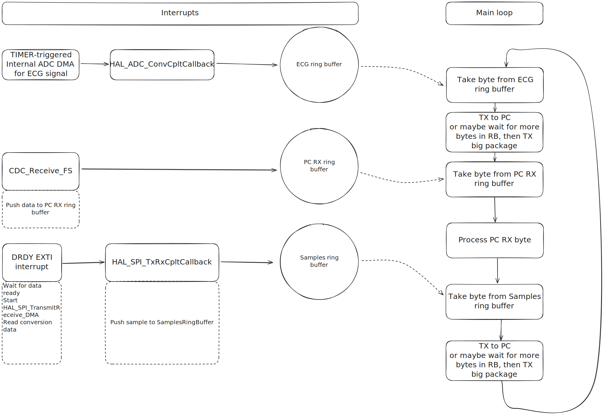

# Программа для считывания данных ЭКГ контроллером STM32G431CBU6

[Документация на код](https://jerrycarson.github.io/ecg_stm/)

## Что требуется реализовать

- [x] Генерация синусоидального сигнала внутренним ЦАП
- [x] Прерывание по DRDY с получением выборок
- [x] Получение выборок сигнала `ECG` и отправка данных в кольцевой буфер
- [x] Протокол общения с ПК: отправка считанных данных, cчитывание команд
- [ ] Обработка команд от ПК
- [ ] Конфигурация микросхем перед стартом преобразования
- [ ] HAL_SPI_TxRxCpltCallback (отправка `conversion data` в кольцевой буфер)
- [ ] Чтение сигналов отрыва электрода, остановка трансляции данных при отрыве
- [ ] Отправка данных с контроллера в ПК

Описание будет дополняться и изменяться в процессе разработки

## Примерная схема получения данных на момент начала разработки



Из даташита на микросхему:

```
The output data rate is defined as: fDATA = fMOD / OSR.

The FLTR_OSR[4:0] register bits program the overall OSR and final data rate of the wideband filter.
FLTR_SEL[2:0] register bits = 000b selects the default coefficient operation and 111b selects the programmable
coefficient operation. See the FILTER1 register for details.
```

Можно сконфигурировать АЦП таким образом чтобы `DATA RATE` был 100 kPSP. Для этого требуется настроить делитель частоты и настроить OSR в фильтре.

В таком случае можно считывать данные по `falling edge` прерыванию пина `DRDY`. Получение данных через равные промежутки времени обеспечивает отсутствие необходимости передачи данных на ПК по строгим таймингам, программе-обработчику на ПК достаточно знать что данные читаются через равные промежутки времени, а так же знать значение этого промежутка.

За один `main` цикл программы можно обрабатывать по 1 байту из каждого буфера, а можно полностью забирать данные из буферов. Какой метод будет более эффективным - станет понятно на практике.

## Схема сбора данных с периферии контроллера

